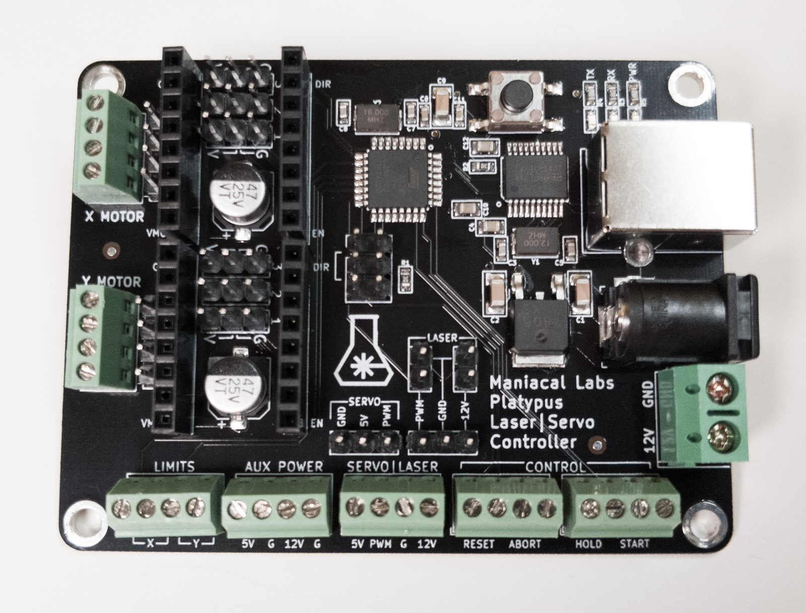

# Platypus CNC / Laser Control Board

The Platypus is an Open Hardware CNC / Laser control board for running 2-axis GRBL with a wide variety of stepper motor driver options.



Unlike other Grbl boards that are just Arduino shields, the Platypus is a fully integrated solution with a built-in ATMega328p microcontroller and USB UART. 

Also, unlike other Grbl boards, the Platypus natively supports configuring Trinamic (TMC) StepStick drivers like the TMC2100 and TMC2208. Unlike normal StepStick motor drivers, the TMC variants use tri-state config pins which the Platypus provides.

# Specs

- Integrated ATMega328p Microcontroller (no arduino needed)
- CH340 USB to UART converter
- Screw terminals for all connections (plus male headers for motor and laser)
- Supports all standard StepStick-style motor drivers including TMC2100 and TMC2208
- Only 57mm x 75mm
- Robust USB-B connector

# Important Links

- [Usage](docs/Usage.md)
- [Assembly](docs/Assembly.md)

# Contributing

This repository makes use of `git` submodules (primarily to handle KiCAD symbol and footprint libraries) and must be cloned with extra options.

Either clone the repo via:

```
git clone --recurse-submodules git@github.com:ManiacalLabs/Platypus.git
```

Or, if you already have the repo cloned or are using a fork:

```
git clone <EngravinatorRepo>
cd Engravinator
git submodule init
git submodule update
```

