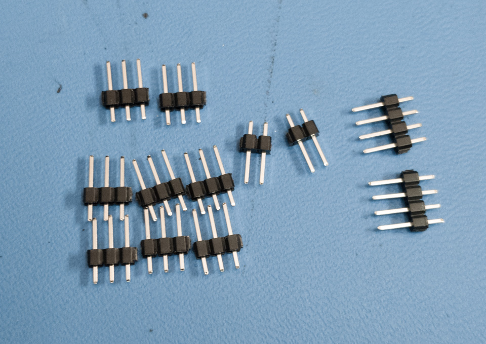
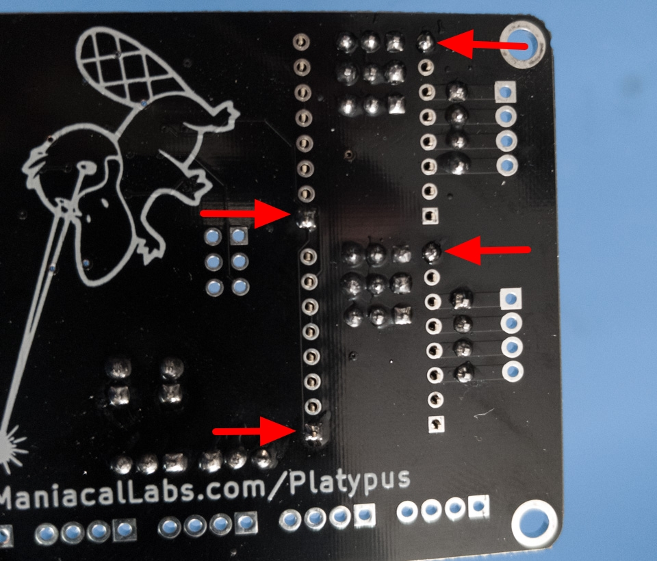
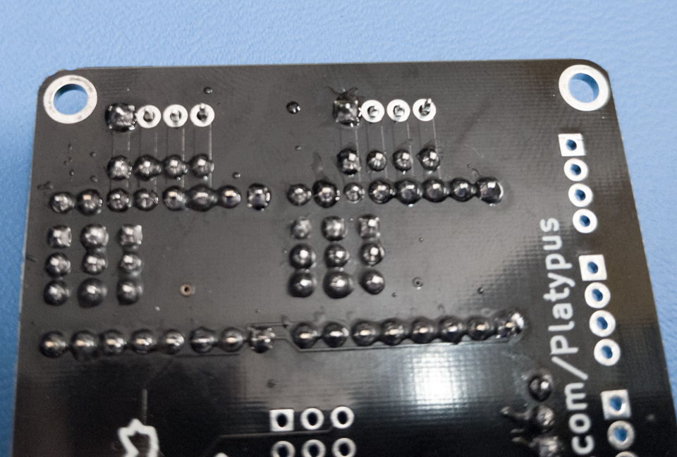

# Platypus Assembly

**If you purchased one of the pre-assembled units, you can just skip this guide!**

Welcome to the wonderful world of the Platypus 2-Axis Laser/Servo controller! We'll be walking you through the assembly of the through-hole components which should only take 10-20 minutes.

First step is to ensure you have all the components shown above. You should have:

- Platypus main PCB
- 7x 4-pin 0.1" screw terminals
- 1x 2-pin 0.2" screw terminal
- 4x 8-pin female header
- 1x 40-pin cuttable male header

Please note that the USB port and power input barrel jack will come pre-assembled (we use these for programming).

Let's get going. We're going to do all components of each type before moving on from shortest to tallest. This allows flipping the board and having those components pushed up against the PCB.

**Note:** *Basically all of these components, except the motor driver headers, are optional depending on what you need. Check out the [Usage](Usage.md) doc and, if you decide you don't need a particular component, feel free to just leave it out.*

## Male Headers

**Note:** *The 2x3 pin male header in the middle of the board is not included and will remain unpopulated. This is an ICSP header for programming.*

Use some flush-cut wire snips to break the 40-pin male header into the following sizes:

- 2x 4-pin
- 8x 3-pin
- 2x 2-pin

You will have one 4-pin section left. That's just spare.

For each of the male header sections, insert them into the appropriately sized spot and use some tape to hold them in place, then flip the board.

**IMPORTANT** *Only solder one pin from each header section at this point!* As shown below.

Flip the board and remove the tape. If the header does not lie flush and perpendicular to the board, press on one of the pins you **DID NOT** solder with a finger and flip the board back over. Apply heat to the pin you did solder and use your finger to realign the header while the solder is molten.

Once you are happy with all the male headers, flip the board and solder all remaining pins.

## Female Motor Driver Headers

For this part it is important that the four 8-pin female headers be aligned correctly. We highly recommend using the motor drivers you plan to use to do this. But, we admit this provides a bit of a chicken-or-egg problem. If your motor driver headers are not already soldered, you have some boot strapping to do.

If you have a breadboard handy, use that to hold the motor driver pins while soldering. If not, before you install the female headers, flip the board and insert the motor driver male pins into the holes on the Platypus PCB, long end down. Then, while holding the Platypus in a PCB vice or similar,  place the motor driver over the short end of the pins. Solder the male pins to the motor drivers but **DO NOT** solder anything to the platypus!! Seriously, don't do that. Now you can continue.

Now attach the female headers to the male headers on the motor drivers and then insert the female header pins into the front of the Platypus PCB.

Flip the board and solder only 2 pins from each motor driver, on opposing corners, as shown below.

Now flip the board back over and ensure that the female headers are sitting flush and perpendicular. If not, heat up the solder on those single pins and adjust. Once everything looks good, flip back over and solder all remaining pins.

## 4-pin Terminals

We recommend doing these in 2 sections: The two motor terminals and the five headers along the bottom edge. We've also found that inserting the terminals and then resting them upside-down with the top of the terminals resting on something about 20mm thick manages to keep everything nicely aligned and flush. As shown below:

**Note:** Make sure you insert the terminals with the holes for the wires facing out! As shown below:

Now, for each section, again you should solder just a single pin on each. Once done, flip the board and ensure that all terminals are flush and straight. 

Once happy with the alignment and certain that all terminals are correctly oriented, solder all remaining pins for each section.

## 2-pin Terminal

One more and then you are done! Though, honestly, this is the most optional of them all as you will likely be using a barrel jack power supply.

This one is easy. Insert the 2-pin header, flip the board and solder. Make sure that the terminal is facing outward.

## All Done!

That's it! Head on over to the [Usage](Usage.md) guide for details on setup and usage.