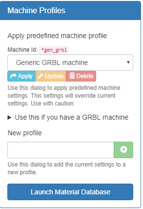
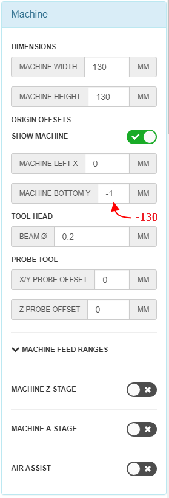
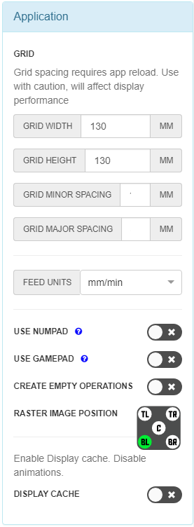
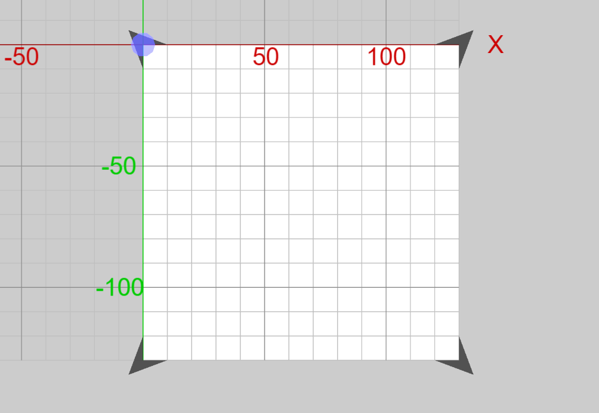

# LaserWeb Software Setup

For using the Platypus with [LaserWeb](https://github.com/LaserWeb/LaserWeb4/) we recommend starting with the official [LaserWeb Machine Profile](https://github.com/LaserWeb/LaserWeb4/wiki/3-Settings-Machine-Profile) documentation.

Open LaserWeb and go to the `Settings` tab, where you can create a new machine profile. Select `Generic GRBL machine` from the drop-down and then click `Apply` to load that base profile.

Now, under the `Machine` section, enter your machine width and height (130x130mm if using the Engravinator). 

If using the Engravinator, in the `Machine Bottom Y` you must enter `-130`. There is a bug in the current UI so it sadly cannot be seen in the screenshot. This offset will be explained below.

The `File Settings` and `GCode` sections require no changes.

Under the `Application` section ensure that your machine height and width are the same values used in the `Machine` section. All other settings should be as shown, especially for the Engravinator.

For the Engravinator, you need to set a workspace offset because it does not home to the origin. In the LaserWeb console, enter `G10 L2 P1 X0 Y-130` and press enter. The Platypus comes with this offset preset but it doesn't hurt to enter it again, in case the setting was wiped. It will retain even after a power cycle. This tells the controller that the location it homed to is actually `0,130` instead of `0,0`.

Your workspace should now look as below:

For the Engravinator note that the laser position is marked in the rear-left (or top-left if you prefer). As this is where it homes to, this will be the position seen after homing.