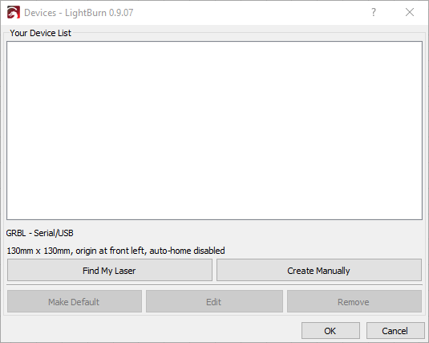
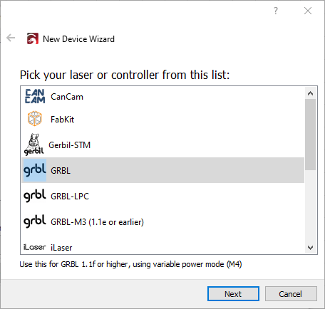
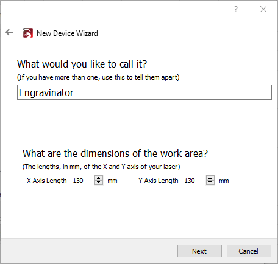
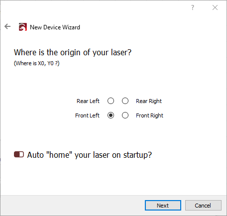
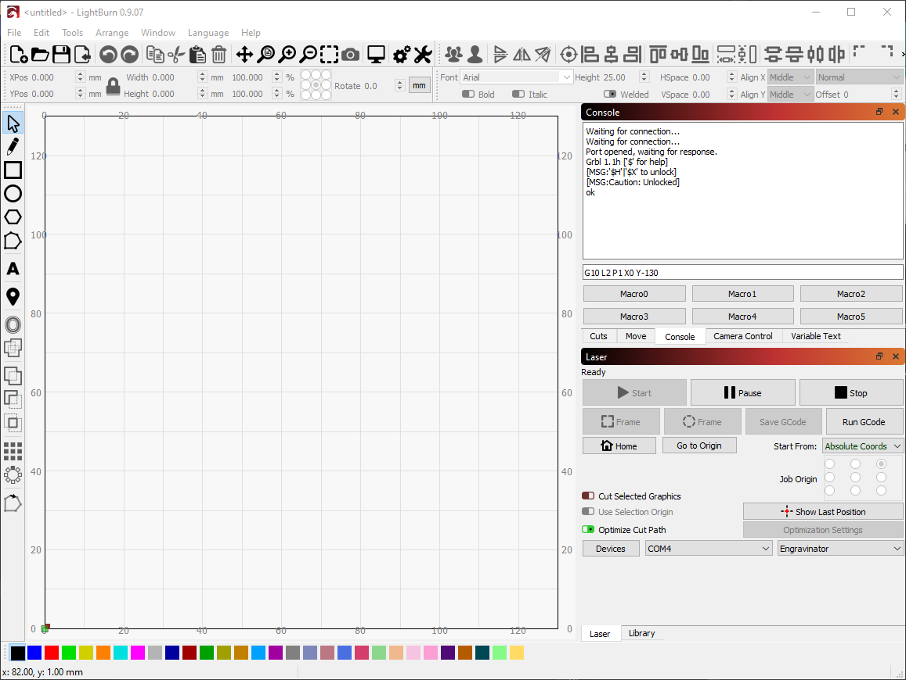

# LightBurn Software Setup

For using the Platypus with [LightBurn](https://lightburnsoftware.com) we recommend starting with the official [LightBurn New Device](https://github.com/LightBurnSoftware/Documentation/blob/master/DeviceWizard.md) documentation.

But you can also use the following for a basic setup. Click on the `Devices` button in the `Laser` window.

Either use `Find My Laser` to automatically detect and add the Platypus or click on `Create Manually`.

If using the manual setup, ensure that you select `GRBL` for the device type dialog:

Give the device a name and set your X and Y axis length. In the case of the [Engravinator](https://engravinator.com) both axis should be 130mm.

Set your origin and auto-homing. In the case of the [Engravinator](https://engravinator.com) the origin is **Front Left** even though it homes to **Rear Left**.

You should now see it connect to the Platypus in the `Console` tab. If it does not, you may need to select the serial port in the drop-down under the `Laser` tab.

Please note that with the [Engravinator](https://engravinator.com) you may need to tell it that the homing location is offset from the origin. In the console, simply enter `G10 L2 P1 X0 Y-130` and press enter. The Platypus comes with this offset preset but it doesn't hurt to enter it again, in case the setting was wiped. It will retain even after a power cycle. This tells the controller that the location it homed to is actually `0,130` instead of `0,0`.