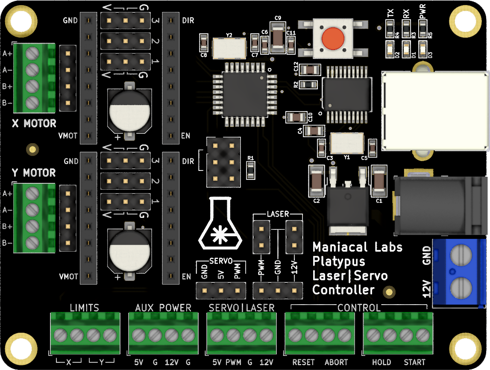

# Platypus Controller Usage

The Platypus is designed to run standard [Grbl](https://github.com/gnea/grbl/wiki) firmware and, therefore, basically everything on the [Grbl Wiki](https://github.com/gnea/grbl/wiki) applies. The primary difference is that most Grbl hardware is a shield for an Arduino board, while the Platypus is a single, integrated, design with everything you need.

The documentation found here mainly exists to call out those things that are specific to the Platypus. Anything else can be found at the [Grbl Wiki](https://github.com/gnea/grbl/wiki).

## Software

As the Platypus uses standard Grbl you may control it with any software that supports Grbl. A lot of grbl software is pretty basic will just connect to the serial port and leave it up to you to not do anything dumb. For software with a bit more intelligence you may need some custom setup. We highly recommend checking the documentation for that software but for those below we've created some simple quick-start guides:

- [LightBurn](LightBurn.md)
- [LaserWeb](LaserWeb.md)

## Connections

All necessary connections are clearly labeled on the PCB itself as seen below. Note that for `LIMITS` and `CONTROL` headers there is no polarity requirement as they are expected to be used with "Normally Open" switches.

### Power

You may either use the 2.1mm, center-positive barrel connector or the large screw terminal for the required input power. 

Please note that the Platypus was designed specifically as a 12V system. DO NOT connect any power other than 12V!

It is recommended to use a power supply that can provide at least 5A.

Finally, note that the Platypus **must** have the 12V supply connected to power up the microcontroller. The USB input **will not** provide any power.

### Motors

You may use either the screw terminals or male headers, depending on the wiring available on your motors. Simply follow the motor phase labels as defined by your motor datasheet. Typically the wires are connected in Blue, Red, Green, Black order. If your motor is running in the wrong direction you can either swap the wire order 180&deg; or [flip the direction mask in Grbl](https://github.com/gnea/grbl/wiki/Grbl-v1.1-Configuration#3--direction-port-invert-mask).

### Laser

If you are using a diode laser it likely came with a cable that is 3-pin on the diode side and either 3-pin or 2x 2-pin on the controller side.

If it uses 3-pin on the controller side, simply connect it to the 3-pin laser male header. Note that, for most lasers:

- Red -> 12V
- Black -> Ground
- Yellow -> PWD

If it uses a 2x 2-pin controller (as in 2 separate 2-pin female connectors), then use the dual 2-pin male headers directly above the 3-pin header. Note that the top-most pins are ground. The same color coding as above applies.

Finally, you can also use the screw terminal. Strip ~3mm of insulation off the end of each wire and connect to `PWM`, `G`, and `12V` on the `SERVO|LASER` terminal. If your have 2 ground wires, just connect both to the `G` terminal. The `5V` connection is not needed as most lasers are 12V.

### Servo

**Note:** Remember that you will need to use different firmware for servo control.

Typically, your servo will come with a 3-pin female connector. In that case, just use the 3-pin male header labeled `SERVO`.

- Brown -> GND
- Red -> 5V
- Orange -> PWM

You may also use the `SERVO|LASER` screw terminal, using the above labeled color mapping. Simply remove ~3mm of insulation from each wire and connect to the screw terminal.

## Limits

For more detailed information see the official Grbl [Wiring Limit Switches](https://github.com/gnea/grbl/wiki/Wiring-Limit-Switches) documentation.

As it's the easiest setup, we recommend using "Normally Open" switches as no firmware changes will be required. If using 2 switches per axis, you may then simply wire both to the same input in parallel. Again, see above linked Grbl documentation for more details.

### Control

As noted, none of these connections require specific polarity. Just use a "Normally Open" switch.

- **RESET**: Connected directly to the microcontroller **Reset** pin. This will immediately reboot the controller and stop all motion.
- **ABORT**: Force Grbl into an ALARM state. **Not** guaranteed to stop immediately. Recommend using above **RESET** pin instead.
- **HOLD**: Pause all motion. Can be resumed with the **START** command or pin.
- **START**: Resume after a hold.

## Motor Drivers

The Platypus supports all standard "StepStick" style motor drivers, such as A4988, DRV8825, TMC2100, and TMC2208. Unlike most other Grbl controllers available, however, the Platypus actually supports jumper configuration of Trinamic (TMC) drivers as it provides both high and low jumpers.

Be sure to align your motor driver pins with the labeled `GND`, `DIR` (direction), `EN` (enable), and `VMOT` (motor voltage). It is important to note that TMC drivers will be inserted with the IC facing down, towards the controller.

To save you the trouble of tracking down how to configure each different driver, we've provided config tables and Vref (for current limiting) formulas below. Note that `O` means `Open` so no jumper is needed. Please see the specific motor driver's documentation on more specific information on configuration and how to set the current limiting.

### A4988

| CFG1 | CFG2 | CFG3 | MicroSteps | 
|------|------|------|------------| 
| O    | O    | O    | 1/1        | 
| V    | O    | O    | 1/2        | 
| O    | V    | O    | 1/4        | 
| V    | V    | O    | 1/8        | 
| V    | V    | V    | 1/16       | 

Vref = 8 * Imax * 0.068

### DRV8825

| CFG1 | CFG2 | CFG3 | MicroSteps | 
|------|------|------|------------| 
| O    | O    | O    | 1/1        | 
| V    | O    | O    | 1/2        | 
| O    | V    | O    | 1/4        | 
| V    | V    | O    | 1/8        | 
| O    | O    | V    | 1/16       | 
| V    | V    | V    | 1/32       | 

Vref = Imax / 2

### TMC2100

| CFG1 | CFG2 | CFG3 | MicroSteps | Notes                    | 
|------|------|------|------------|--------------------------| 
| G    | G    | O    | 1/1        | SpreadCycle / No Interp  | 
| V    | G    | O    | 1/2        | SpreadCycle / No Interp  | 
| O    | G    | O    | 1/2        | SpreadCycle / 256 Interp | 
| G    | V    | O    | 1/4        | SpreadCycle / No Interp  | 
| V    | V    | O    | 1/16       | SpreadCycle / No Interp  | 
| O    | V    | O    | 1/4        | SpreadCycle / 256 Interp | 
| G    | O    | O    | 1/16       | SpreadCycle / 256 Interp | 
| V    | O    | O    | 1/4        | StealthChop / 256 Interp | 
| O    | O    | O    | 1/16       | StealthChop / 256 Interp | 

Vref = Imax

### TMC2208

| CFG1 | CFG2 | CFG3 | MicroSteps | Notes                     | 
|------|------|------|------------|---------------------------| 
| V    | G    | O    | 1/2        | StealthChop2 / 256 Interp | 
| G    | V    | O    | 1/4        | StealthChop2 / 256 Interp | 
| G    | G    | O    | 1/8        | StealthChop2 / 256 Interp | 
| V    | V    | O    | 1/16       | StealthChop2 / 256 Interp | 

Vref = Imax

The TMC2208 also supports SpreadCycle but that must be configured over UART manualy.

## Firmware

The Platypus comes with basic 2-axis Grbl firmware pre-installed. This is important as the default Grbl assumes you will be using 3 axis and homing will fail because there's no Z axis to home in this case. Unfortunately fixing this requires modifying `config.h` in Grbl. Fortunately, we've done the hard work for you.

Note that it also comes pre-configured with all the Grbl settings required for the [Engravinator](https://engravinator.com). If you need to change these settings, please see the official [Grbl Configuration](https://github.com/gnea/grbl/wiki/Grbl-v1.1-Configuration) documentation.

You should not generally need to ever upload new firmware, but if you do we recommend starting with the [official Platypus config.h](https://github.com/ManiacalLabs/grbl/blob/master/configs/2_axis/config.h) as a jumping-off point.

You may also download the [default firmware hex](https://github.com/ManiacalLabs/grbl/blob/builds/2_axis.hex) and upload it to your board via avrdude or XLoader.